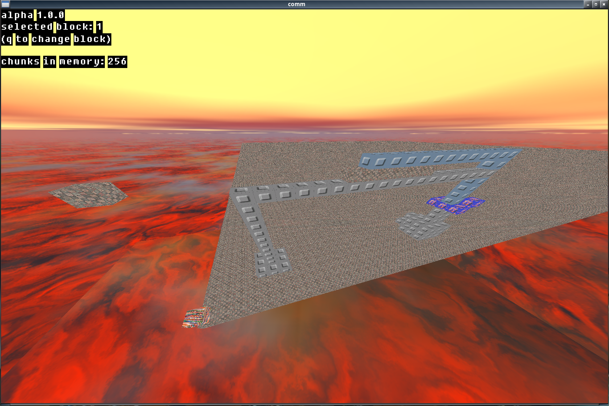
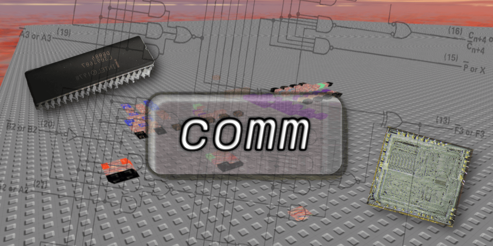

# ComputerMaker

This is a WIP kinda-clone of [CM2](https://www.roblox.com/games/6652606416/Circuit-Maker-2) in C. \
The original is made in Roblox which limits the speed of the simulation enough to be exceeded. \
We have no idea of computer graphics.

### [``ComputerMaker Discord``](https://discord.gg/gCkxb2uRrU)



## Contribution

To contribute, look at [CONTRIBUTING.md](CONTRIBUTING.md).

## Quickstart (Linux)

#### Requirements

- Linux
- GCC
- GNUMake
- [GLFW](https://www.glfw.org) lib
- [cglm](https://github.com/recp/cglm) lib

#### To run the app

```sh
make run
```

#### Known Problems

1. If your IDE complains about includes, try `bear -- make`.

## Info to use the software

### Controls

> [!NOTE] 
> The currently selected block is painted with a red gradient

WASD to move around \
Scroll wheel to change FOV \
Left click to place/destroy/wire (depends on the mode)

Keybind||
---|---
E|Go to next mode
Q|Change block
O|Toggle wireframe mode
R|Reset camera to 0, 0, 0
Z|Save the world to `SAVELOAD` (from config.comm) filename

### Modes

Modes|Info|
---|---
BLOCK_PLACE|Place a block
WIRE_PLACE|Place a wire connection from block -> block
WIRE_DESTROY|Destroy a wire connection from block -> block
BLOCK_POKE|The block will be poked. For example, poking a Flipflop toggles it.

### Wire mode

When you are in wire mode:
1. Left click to select the source block
2. Go to the destination block
3. Left click to select the destination block
4. Now the source block is connected to the destination block.

## Configuring it

Each time you start the game, it reads the file named `config.comm` \
This file is in the ``res`` (resource) folder \
You can also add comments to it using `;` \
Here are the specifications

Parameter|Info|
---|---
SKY_RT|Filename of the image for the right side of the skybox
SKY_LF|Filename of the image for the left side of the skybox
SKY_UP|Filename of the image for the top side of the skybox
SKY_DN|Filename of the image for the bottom side of the skybox
SKY_FT|Filename of the image for the front side of the skybox
SKY_BK|Filename of the image for the back side of the skybox
SAVELOAD|Native save file to load when starting the game
SAVETO|Filename of the native save file, the world is saved here pressing Z
CM2SAVE|A Circuit Maker 2 save to load when starting the game. Note that SAVELOAD loads the save first, then this.
CHUNK_AMOUNT_X|How much chunks to generate in the X axis at world generation
CHUNK_AMOUNT_Z|How much chunks to generate in the Z axis at world generation
FONTSCALE|Global scale for fonts
CHAT_FONTSCALE|scale for chat message text
CHAT_Y_SUB|Y (Vertical) offset subtraction for chat position
CHAT_X_OFFSET|X (Horizontal) offset for chat position
CHAT_COLOR_R|chat text color - red channel (0 - 255)
CHAT_COLOR_G|chat text color - green channel (0 - 255)
CHAT_COLOR_B|chat text color - blue channel (0 - 255)